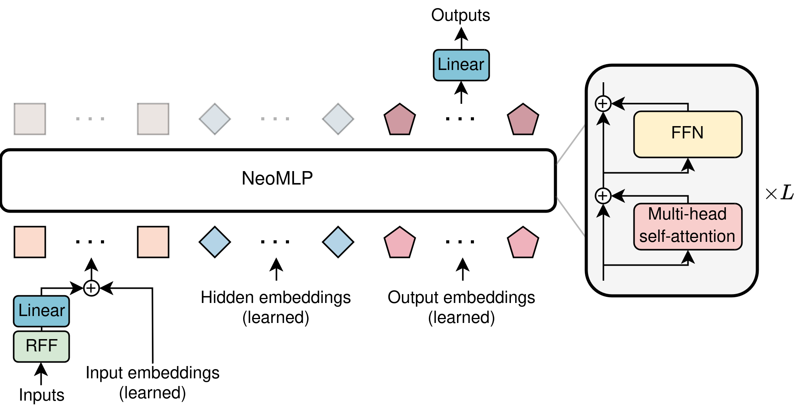

# From MLP to NeoMLP

Official implementation for
<pre>
<b>From MLP to NeoMLP: Leveraging Self-Attention for Neural Fields</b>
<a href="https://mkofinas.github.io/">Miltiadis Kofinas</a>*, <a href="https://samuelepapa.github.io/">Samuele Papa</a>, <a href="https://egavves.com/">Efstratios Gavves</a>
<em>Preprint</em>
<a href="https://arxiv.org/abs/2412.08731">https://arxiv.org/abs/2412.08731/</a>
</pre>

<picture>
  <source media="(prefers-color-scheme: dark)" srcset="assets/neomlp.png">
  <source media="(prefers-color-scheme: light)" srcset="assets/neomlp.png.png">
  
</picture>

Coming soon!
